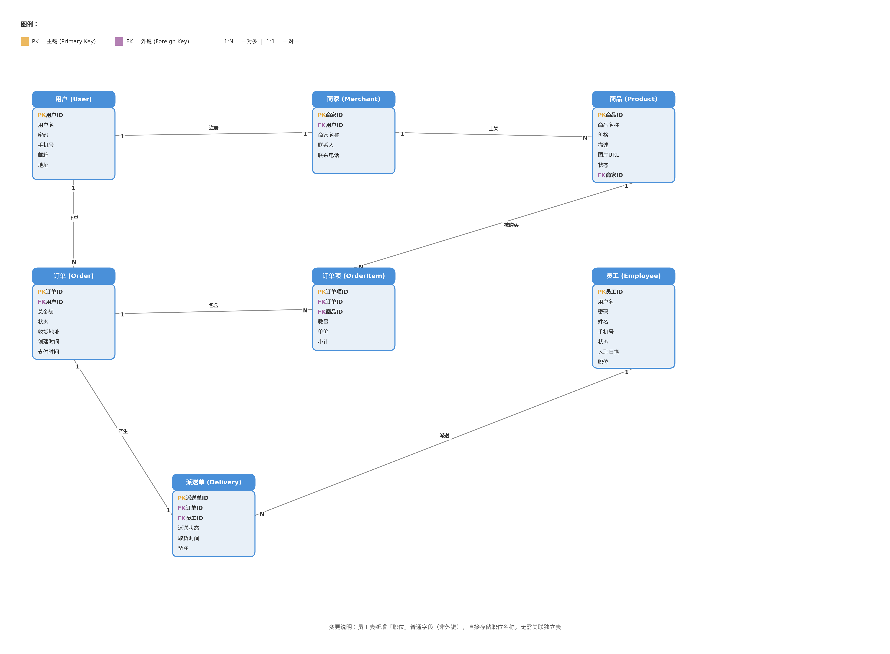

## 1.架构设计

#### 	1.common

​		子模块，存放公共类，异常，工具类等等。

​		

|    层级    |    内容    |           备注            |
| :--------: | :--------: | :-----------------------: |
|   utils    | 封装工具类 | oss调用，jjwt生成和校验等 |
|   result   | 返回结果类 |        类型为.json        |
| properties |   配置类   |                           |

#### 	2.server

​		子模块，web 所用后端，使用Spring Boot的基本文件格式构建本module的文件层次，存放配置文件等。

|    层级    |          内容          |                     备注                     |
| :--------: | :--------------------: | :------------------------------------------: |
|   mapper   |  mybatis数据库基础层   |                                              |
|  service   |  调用mapper封装方法层  | login登录功能校验token令牌需要，事务管理需要 |
|   filter   |     过滤器拦截请求     |          拦截登录外请求或发送token           |
| controller | 封装成接口，供前端使用 |                                              |
|   启动类   |      程序启动入口      |            Spring Boot默认启动类             |
|  handler   |     全局异常处理器     |                                              |

#### 	3.pojo

​		子模块，存放实体类型

|  层级  |           内容           | 备注 |
| :----: | :----------------------: | :--: |
| entity | 与数据库中的封装类型一样 |      |
|  dto   |       数据传输对象       |      |
|   vo   |    视图对象，传给前端    |      |

#### 	4.总模块

​		父模块，pom配置Spring Boot BOM的版本。

## 2.数据库设计

一切已sql建表语句为准。



#### 	1.employee

|    名称    |     类型     |       备注       |
| :--------: | :----------: | :--------------: |
|     id     | unsigned int |       主键       |
|    name    |   varchar    |                  |
|   stage    | unsigned int | 0为空闲1为配送中 |
| entry_time |     date     |                  |
|  username  |   varchar    |                  |
|  password  |   varchar    |                  |
|    job     | unsigned int | 0为管理1为配送员 |

#### 2.product

|   名称   |     类型     |      备注      |
| :------: | :----------: | :------------: |
|    id    | unsigned int |      主键      |
|   name   |   varchar    |                |
| describe |   varchar    |                |
|   img    |   varchar    |      oss       |
|  stage   | unsigned int | 0为有货1为无货 |
|  mer_id  |   unsigned   |   对应商家id   |

#### 3.user

|    名称     |     类型     | 备注 |
| :---------: | :----------: | :--: |
|     id      | unsigned int | 主键 |
|  username   |   varchar    |      |
|    phone    |   varchar    |      |
|  password   |   varchar    |      |
|   address   |   varchar    |      |
| create_time |     date     |      |

#### 4.merchant

|  名称  |     类型     |    备注    |
| :----: | :----------: | :--------: |
|   id   | unsigned id  |    主键    |
|  name  |   varchar    |            |
| person |   varchar    |            |
| phone  |   varchar    |            |
| us_id  | unsigned int | 对应用户id |

#### 5.order

|    名称     |     类型     |          备注          |
| :---------: | :----------: | :--------------------: |
|     id      | unsigned int |          主键          |
|    money    |   Integer    |                        |
|    stage    | unsigned int | 0为未送达1为已送达完成 |
| re_address  |   varchar    |        收获地址        |
| create_time |     date     |                        |
|  pay_time   |    date！    |    可空,空为未支付     |
|    us_id    | unsigned int |                        |

#### 6.order_item (包含在order中)

|   名称    |     类型     |    备注    |
| :-------: | :----------: | :--------: |
|    id     | unsigned int |    主键    |
|  ord_id   | unsigned int | 对应订单id |
|  pro_id   | unsigned int | 对应商品id |
|    num    | unsigned int |            |
| per_money |   Integer    |            |
|   total   |   Integer    |            |

#### 7.delivery

|   名称   |     类型     |             备注              |
| :------: | :----------: | :---------------------------: |
|    id    | unsigned int |             主键              |
|  ord_id  | unsigned int |          对应订单id           |
|  emp_id  | unsigned int |          对应员工id           |
|  stage   | unsigned int | 0为未派送1为正在派送2为已送达 |
| arr_time |     date     |           送达时间            |
|   note   |   varchar    |             备注              |

**<u>所有主键均为自动增加</u>**

## 3.接口与功能

主要功能： 用户登录后可以创建订单 查看商品和商铺 在订单中添加商品 付款后生成运输单 运输单子可以被员工<u>配送员</u>接取

afxp_4933f1KNvIRKucURz3ezXipEmynT0wGnQcKl APIfox密钥  8402160 项目id

#### 1.后台管理层

##### 1.员工管理

删除员工 

修改员工 

添加员工 

查询员工的基本功能（实现基本分页功能）

员工的登录 登录使用token令牌登录，密码不加密

##### 2.用户管理

删除用户

修改用户

添加用户

查询用户

##### 3.用户店铺管理（后台管理）

注册店铺 

修改店铺

删除店铺（确定删除保险）

店铺营业店铺关闭

店铺总查询 

##### 4.商品管理

在店铺中上架该商品

查询所有商品

商品模糊查询

阿里云oss存储照片返回网址

##### 5.订单管理

创建订单

提交订单

（支付订单）

查询订单

取消订单（支付前）

##### 6.配送接单管理

配送员接单

完成配送 put

查看个人配送记录


## 4.核心功能设计

#### 1.用户下单

用户下单 —— 前端操作 —— 返回核心数据

数据类型{

code

message

data{

```java
private Integer id;
private Integer usId;
private double money;
private String reAddress;
private LocalDate createTime;
private List<OrderItem> orderItems;
```

前端传money会导致完全信任前端数据，所以在后端进行数据查询累计加上数据，total_money传给数据库

}

}

返回核心数据 —— 

controller

```java
@PostMapping
public Result add(@RequestBody OrderParam orderParam){
    Integer id = Context.getId();
    if(id == null){
        return Result.error("请先登录");
    }
    orderParam.setCreateTime(LocalDate.now());
    orderParam.setUsId(id);
    orderService.add(orderParam);
    return Result.success();
}
```

根据threadloacl用户上下文进行token令牌抓取，判断是否已经登录。

在其中需要填入UsId和createtime两项后端数据

—— service

```java
@Transactional
@Override
public void add(OrderParam orderParam) {
    // 计算订单总金额
    Integer money = 0;
    for (OrderItem orderItem : orderParam.getOrderItems()) {
        money += orderItem.getTotal();
    }
    // 设置金额后插入订单，获取自增id
    orderParam.setMoney(money);
    orderMapper.add(orderParam);
    // 将订单id回填到每个明细项
    for (OrderItem orderItem : orderParam.getOrderItems()) {
        orderItem.setOrdId(orderParam.getId());
    }
    // 批量插入订单明细
    orderItemMapper.add(orderParam.getOrderItems());
}
```

已废弃。

- 商品是否存在

- 商品是否已下架

- 没有用后端价格重新计算总价

- 没有考虑空的orderitem情况

- 同商铺校验，便于配送

- ```java
  @Transactional
  @Override
  public void add(OrderParam orderParam) {
      List<OrderItem> items = orderParam.getOrderItems();
      if (items == null || items.isEmpty()) {
          throw new RuntimeException("订单明细不能为空");
      }
      // 校验商品：存在性、未下架、同商铺，同时用后端价格计算金额
      Integer merId = null;
      double money = 0;
      for (OrderItem item : items) {
          Product product = productMapper.selectById(item.getProId());
          if (product == null) {
              throw new RuntimeException("商品不存在: proId=" + item.getProId());
          }
          // 0有货 1无货（下架）
          if (product.getStage() != 0) {
              throw new RuntimeException("商品已下架: " + product.getName());
          }
          // 同商铺校验
          if (merId == null) {
              merId = product.getMerId();
          } else if (!Objects.equals(merId, product.getMerId())) {
              throw new RuntimeException("订单中商品必须属于同一商铺");
          }
          // 使用后端价格，不信任前端传值
          item.setPerMoney(product.getPrice());
          item.setTotal(product.getPrice() * item.getNum());
          money += item.getTotal();
      }
      orderParam.setMoney(money);
      // 插入订单，获取自增id
      orderMapper.add(orderParam);
      // 将订单id回填到每个明细项
      for (OrderItem item : items) {
          item.setOrdId(orderParam.getId());
      }
      // 批量插入订单明细
      orderItemMapper.add(items);
  }
  ```

#### 2.配送员接单


## 5.数据库相关

```mysql
#create database
CREATE DATABASE IF NOT EXISTS com_shop
  CHARACTER SET utf8mb4
  COLLATE utf8mb4_general_ci;

USE com_shop;

#create employee
CREATE TABLE IF NOT EXISTS employee (
    id INT UNSIGNED AUTO_INCREMENT PRIMARY KEY COMMENT '员工ID',
    name VARCHAR(20) NOT NULL COMMENT '姓名',
    stage INT UNSIGNED DEFAULT 0 COMMENT '状态: 0空闲 1配送中',
    entry_time DATE COMMENT '入职日期',
    username VARCHAR(30) NOT NULL UNIQUE COMMENT '登录账号',
    password VARCHAR(30) NOT NULL COMMENT '登录密码',
    job INT UNSIGNED DEFAULT 0 COMMENT '岗位: 0管理员1 配送员'
) ENGINE=InnoDB DEFAULT CHARSET=utf8mb4 COMMENT='员工表';

#create user
CREATE TABLE user (
    id         INT UNSIGNED AUTO_INCREMENT PRIMARY KEY COMMENT '主键',
    username    VARCHAR(255) NOT NULL COMMENT '用户名',
    phone       VARCHAR(20)  COMMENT '手机号',
    password    VARCHAR(255) NOT NULL COMMENT '密码',
    address    VARCHAR(500) COMMENT '地址',
    create_time DATE         COMMENT '创建时间'
) ENGINE=InnoDB DEFAULT CHARSET=utf8mb4 COMMENT='用户表';


#create shop
CREATE TABLE merchant (
    id INT UNSIGNED NOT NULL AUTO_INCREMENT PRIMARY KEY COMMENT '主键',
    name VARCHAR(255) NOT NULL DEFAULT '' COMMENT '名称',
    person VARCHAR(255) NOT NULL DEFAULT '' COMMENT '联系人',
    phone VARCHAR(50) NOT NULL DEFAULT '' COMMENT '电话',
    us_id INT UNSIGNED NOT NULL COMMENT '对应用户id'
) ENGINE=InnoDB DEFAULT CHARSET=utf8mb4 COMMENT='商户表';

-- 4. 商品表
CREATE TABLE `product` (
    `id`       INT          NOT NULL AUTO_INCREMENT COMMENT '商品ID',
    `name`     VARCHAR(100) DEFAULT NULL            COMMENT '商品名称',
    `describe` VARCHAR(500) DEFAULT NULL            COMMENT '商品描述',
    `img`      VARCHAR(300) DEFAULT NULL            COMMENT '商品图片URL',
    `stage`    TINYINT      DEFAULT 1               COMMENT '状态: 0有货 1无货',
    `mer_id`   INT          NOT NULL                COMMENT '所属商铺ID',
    PRIMARY KEY (`id`),
    KEY `idx_mer_id` (`mer_id`)
) ENGINE=InnoDB DEFAULT CHARSET=utf8mb4 COMMENT='商品表';

-- 添加商品价格
alter table product add column price double not null comment '商品价格';

-- 5. 订单表（order 是 MySQL 保留字，需用反引号）
CREATE TABLE `order` (
    `id`          INT          NOT NULL AUTO_INCREMENT COMMENT '订单ID',
    `us_id`       INT          NOT NULL                COMMENT '下单用户ID',
    `money`       double          DEFAULT NULL            COMMENT '订单金额（分）',
    `stage`       TINYINT      DEFAULT 0               COMMENT '状态: 0未送达 1已送达',
    `re_address`  VARCHAR(200) DEFAULT NULL            COMMENT '收货地址',
    `create_time` DATE         DEFAULT NULL            COMMENT '创建时间',
    `pay_time`    DATE         DEFAULT NULL            COMMENT '支付时间',
    PRIMARY KEY (`id`),
    KEY `idx_us_id` (`us_id`)
) ENGINE=InnoDB DEFAULT CHARSET=utf8mb4 COMMENT='订单表';

-- 6. 订单明细表
CREATE TABLE `order_item` (
    `id`        INT NOT NULL AUTO_INCREMENT COMMENT '明细ID',
    `ord_id`    INT NOT NULL                COMMENT '订单ID',
    `pro_id`    INT NOT NULL                COMMENT '商品ID',
    `num`       INT NOT NULL                COMMENT '商品数量',
    `total`     INT DEFAULT NULL            COMMENT '商品总价（分）',
    `per_money` INT DEFAULT NULL            COMMENT '商品单价（分）',
    PRIMARY KEY (`id`),
    KEY `idx_ord_id` (`ord_id`),
    KEY `idx_pro_id` (`pro_id`)
) ENGINE=InnoDB DEFAULT CHARSET=utf8mb4 COMMENT='订单明细表';

alter table order_item modify column total double;
alter table order_item modify column per_money double;

-- 7. 配送表
CREATE TABLE `delivery` (
    `id`       INT          NOT NULL AUTO_INCREMENT COMMENT '配送ID',
    `ord_id`   INT          NOT NULL                COMMENT '订单ID',
    `emp_id`   INT          NOT NULL                COMMENT '配送员ID',
    `stage`    TINYINT      DEFAULT 0               COMMENT '状态: 0未派送 1正在派送 2已送达',
    `arr_time` DATE         DEFAULT NULL            COMMENT '送达时间',
    `note`     VARCHAR(200) DEFAULT NULL            COMMENT '备注',
    PRIMARY KEY (`id`),
    UNIQUE KEY `uk_ord_id` (`ord_id`),
    KEY `idx_emp_id` (`emp_id`)
) ENGINE=InnoDB DEFAULT CHARSET=utf8mb4 COMMENT='配送表';
```
